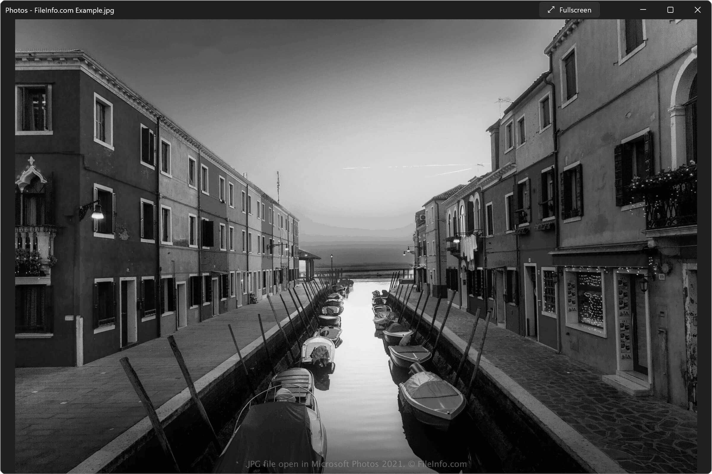
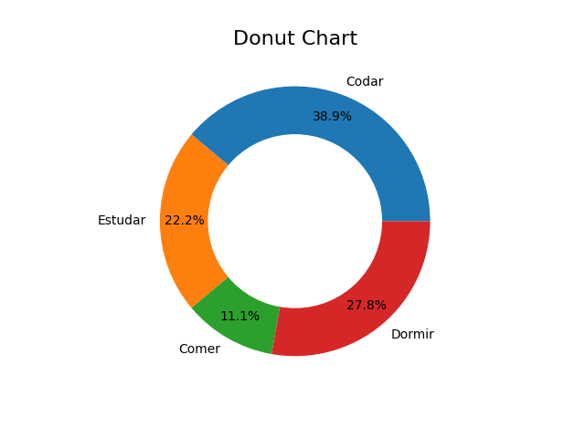

### Número por Extenso

#### Descrição

> Biblioteca **Pillow** adiciona recursos de processamento de imagem ao seu interpretador Python. Esta biblioteca oferece amplo suporte a formatos de arquivo, uma representação interna eficiente e recursos de processamento de imagem bastante poderosos. A biblioteca principal de imagens foi projetada para acesso rápido aos dados armazenados em alguns formatos básicos de pixels. Deve fornecer uma base sólida para uma ferramenta geral de processamento de imagens

> Documentação: https://pypi.org/project/pillow/

---

#### Comandos

<details>

##### `INFO` - Instale **pillow** usando pip
``` bash
 $ pip install pillow
```

</details>

#### IMAGENS

###### `IMAGEM 01`

<details>

| **ORIGINAL**                     | **PRETO E BRANCO**             |
| -------------------------------- | ------------------------------ |
|  |  |

</details>
 
###### `IMAGEM 02`

<details>

| **ORIGINAL**                     | **PRETO E BRANCO**             |
| -------------------------------- | ------------------------------ |
|  |  |

</details>

###### `IMAGEM 03`

<details>

| **ORIGINAL**                     | **PRETO E BRANCO**             |
| -------------------------------- | ------------------------------ |
|  |  |

</details>

###### `IMAGEM 04`

<details>

| **ORIGINAL**                     | **PRETO E BRANCO**             |
| -------------------------------- | ------------------------------ |
|  |  |

</details>

###### `IMAGEM 05`

<details>

| **ORIGINAL**                     | **PRETO E BRANCO**             |
| -------------------------------- | ------------------------------ |
|  |  |

</details>

